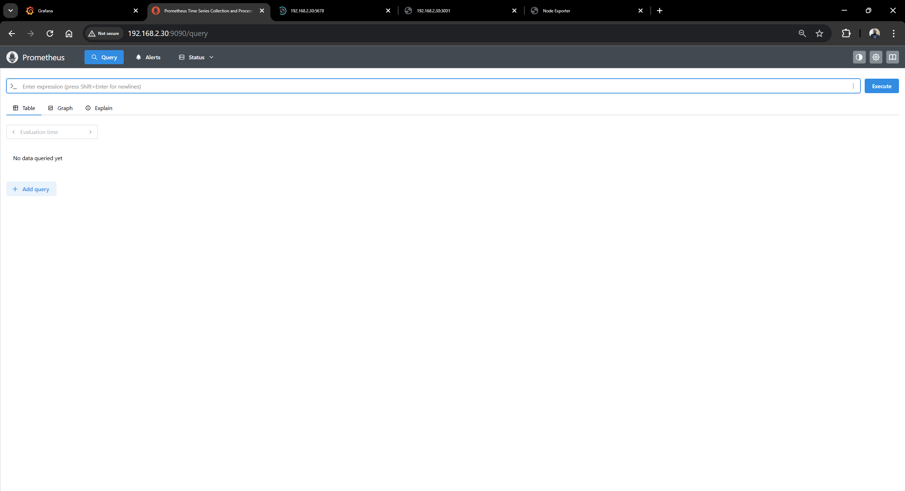
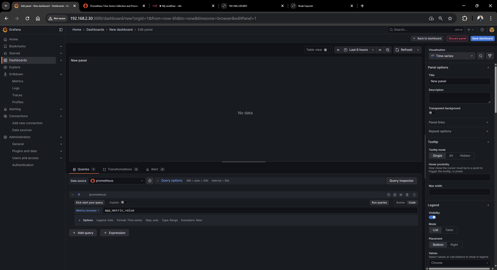
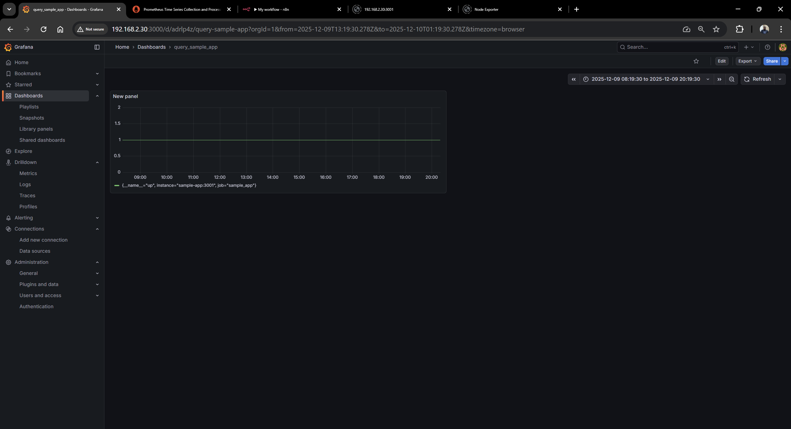
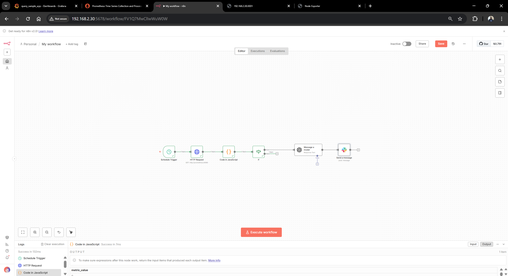
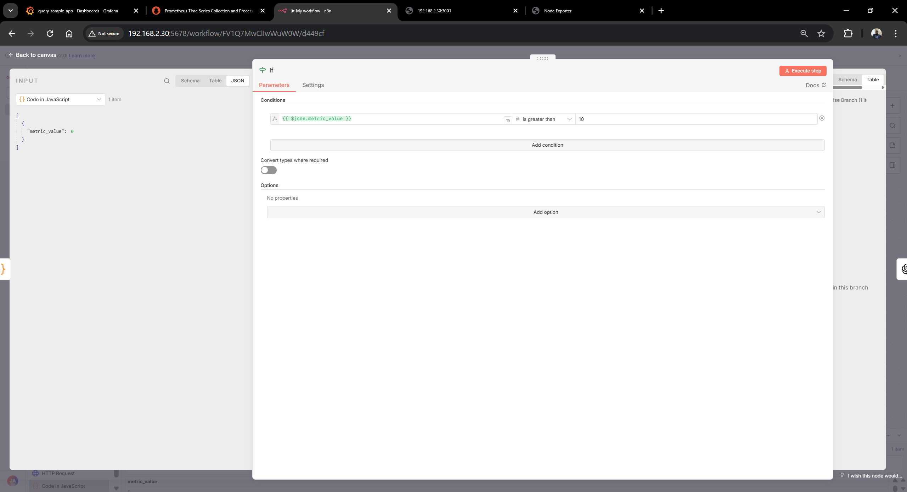
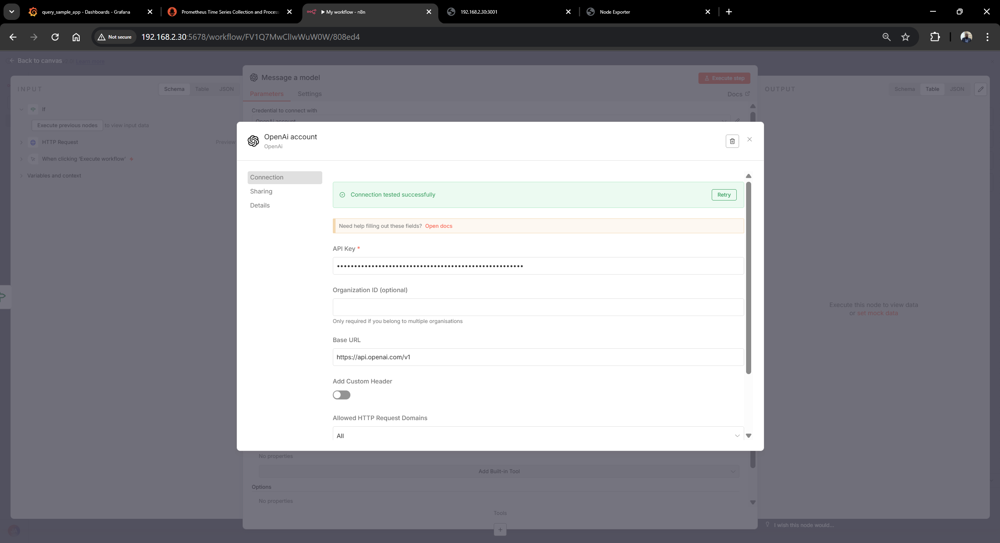
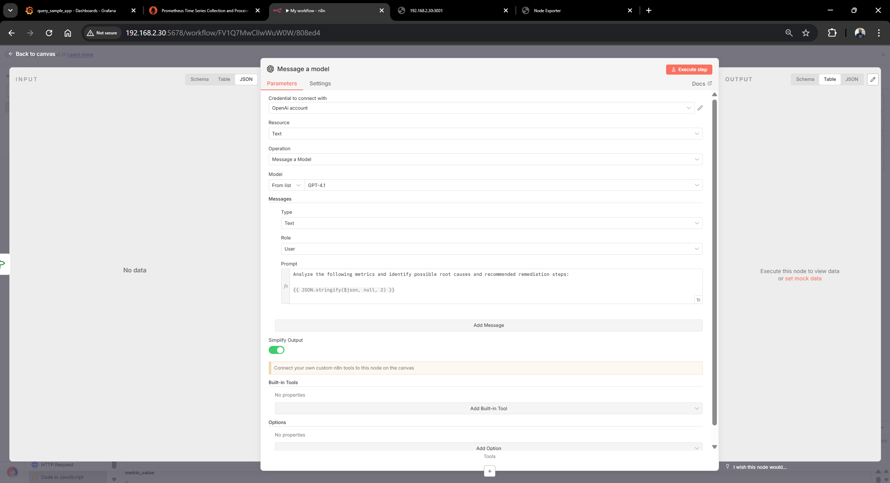

# End-to-End Observability & Automation Project

## 📘 Overview
This project demonstrates how to build a complete observability and automated incident-response system using the following tools:

- **Prometheus** → Metrics collection
- **Grafana** → Metrics visualization (dashboards, alerts)
- **n8n** → Workflow automation & AI-assisted alert analysis
- **Node.js Sample App** → Exposes custom metrics used throughout the project

You will:
1. Deploy Prometheus & Grafana using Docker
2. Instrument an application to expose metrics
3. Build Grafana dashboards to visualize live data
4. Create alerts based on metric thresholds
5. Build an n8n AI-driven workflow that:
   - Polls Prometheus using its API
   - Checks metrics
   - Uses OpenAI for anomaly interpretation
   - Sends Slack/Email alerts

---

# 🏗️ Architecture

```
+----------------+       +----------------+       +-------------------+
|    Node App    | ----> |   Prometheus   | ----> |      Grafana      |
| Exposes /metrics|      | Scrapes metrics|       | Dashboards/Alerts |
+----------------+       +----------------+       +-------------------+
                                                     |
                                                     v
                                           +-------------------+
                                           |       n8n         |
                                           |  AI Incident Bot  |
                                           +-------------------+
```

---

# 🧩 1. Install Prometheus

Create `prometheus.yml` in your project directory:

```yaml
global:
  scrape_interval: 15s

scrape_configs:
  - job_name: 'prometheus'
    static_configs:
      - targets: ['localhost:9090']
  - job_name: 'nodeapp'
    static_configs:
      - targets: ['host.docker.internal:3001']
```

Run Prometheus:

```bash
docker run -d \
  --name prometheus \
  -p 9090:9090 \
  -v $(pwd)/prometheus.yml:/etc/prometheus/prometheus.yml \
  prom/prometheus
```

You should now have Prometheus running at:
👉 **http://localhost:9090**



---

# 📊 2. Install Grafana

```bash
docker run -d \
  --name grafana \
  -p 3000:3000 grafana/grafana
```

Login using:
- Username: `admin`
- Password: `admin`

### Add Prometheus as a data source
1. Navigate to **Configuration → Data sources**
2. Add data source: **Prometheus**
3. Set URL:
   - `http://host.docker.internal:9090` (Windows/macOS)
   - `http://localhost:9090` (Linux)
4. Click **Save & Test**



---

# 📈 3. Build Dashboards (3 Metrics Panels)
Create a new dashboard in Grafana.

Add 3 panels:

---
### **Panel 1: Total Requests**
**Query:**
```
sampleapp_request_count
```

---
### **Panel 2: Error Count**
```
sampleapp_error_count
```

---
### **Panel 3: Response Duration (Average or Histogram)**
```
rate(http_request_duration_seconds_sum[1m])
/ rate(http_request_duration_seconds_count[1m])
```




---

# 🧪 4. Generate Traffic for Testing

### Normal traffic:
```bash
for i in {1..100}; do curl -s http://localhost:3001/ >/dev/null; done
```

### Error traffic:
```bash
for i in {1..20}; do curl -s http://localhost:3001/error >/dev/null; done
```

### What you should observe:
- Request panel increases
- Error panel spikes
- Duration panel moves in real-time

---

# 🧩 5. Install Node Exporter

Node Exporter provides system-level metrics (CPU, memory, disk, network) for Prometheus.

Run Node Exporter:
```bash
docker run -d \
  --name node_exporter \
  -p 9100:9100 \
  prom/node-exporter
```

Add a new scrape job in `prometheus.yml`:
```yaml
- job_name: 'node_exporter'
  static_configs:
    - targets: ['host.docker.internal:9100']
```
Restart Prometheus to apply changes.


---

# 🧩 6. Install Sample Application (Node.js)
This sample app exposes custom metrics at `/metrics`.

Example folder structure:
```
sample-app/
  package.json
  server.js
```

Install dependencies:
```bash
npm install express prom-client
```

Example `server.js`:
```javascript
const express = require('express');
const client = require('prom-client');

const app = express();
const collectDefaultMetrics = client.collectDefaultMetrics;
collectDefaultMetrics();

const requestCount = new client.Counter({
  name: 'sampleapp_request_count',
  help: 'Total number of requests'
});

app.get('/', (req, res) => {
  requestCount.inc();
  res.send('Hello World');
});

app.get('/metrics', async (req, res) => {
  res.set('Content-Type', client.register.contentType);
  res.end(await client.register.metrics());
});

app.listen(3001, () => console.log('App running on port 3001'));
```

Run the app:
```bash
node server.js
```

Prometheus will now scrape:
```
http://host.docker.internal:3001/metrics
```

---

# 🤖 7. Create n8n Automation Workflow
Open **http://localhost:5678**



## Workflow Steps

### **Node 1 — Schedule Trigger**
- Set to run every **1 minute**

### **Node 2 — HTTP Request to Prometheus**
Request type: **GET**

URL example:
```
http://host.docker.internal:9090/api/v1/query?query=sampleapp_request_count
```

Repeat this node for:
- Error count
- Latency

### **Node 3 — IF Node (Threshold Checks)**



Conditions:
```
{{ $json.data.result[0].value[1] }} > 100
```
```
{{ $json.error_rate }} > 10
```
```
{{ $json.avg_latency }} > 0.2
```

### **Node 4 — OpenAI Node (Analysis)**
Use your **OpenAI API Key**.





**Prompt example:**
```
Act as an SRE. Analyze these metrics:
Requests: {{$json.requests}}
Errors: {{$json.errors}}
Latency: {{$json.latency}}
Explain root cause and give remediation steps.
```

### **Node 5 — Slack/Email Alert**
Send formatted alert.


---

# 🔐 How to Generate OpenAI API Key
Visit:
https://platform.openai.com/account/api-keys

Create a **new secret key**.

Paste into n8n under:
```
Credentials → OpenAI API
```

---

# 📬 6. Final End-to-End Test
Generate new errors:
```bash
for i in {1..50}; do curl -s http://localhost:3001/error >/dev/null; done
```

### Expected Behaviour
| Component | Expected Output |
|----------|------------------|
| **Prometheus** | Metrics increase instantly |
| **Grafana** | Panels update with spikes |
| **n8n** | Workflow triggers automatically |
| **Slack/Email** | AI-generated incident report arrives |

---

# 📚 Screenshots to Include in Repo
Add the following screenshots in a `/screenshots` folder:

- Prometheus UI showing metrics
- Grafana dashboard with 3 panels
- n8n workflow editor
- n8n execution logs
- Slack/Email alert result

Use placeholders like:
```

```

---

# 🧯 Troubleshooting

### Prometheus not scraping metrics?
- Check container IP or use `host.docker.internal` on Windows/macOS
- Validate config:
  ```bash
  docker exec prometheus promtool check config /etc/prometheus/prometheus.yml
  ```
- Ensure `/metrics` endpoint works:
  ```bash
  curl http://localhost:3001/metrics
  ```

### Grafana cannot connect to Prometheus?
- Verify Prometheus is running:
  ```bash
  docker ps
  ```
- In Grafana, ensure URL matches your OS:
  - Windows/macOS → `http://host.docker.internal:9090`
  - Linux → `http://localhost:9090`

### n8n workflow not triggering?
- Ensure Schedule Trigger is enabled
- Run Prometheus query manually to confirm result format
- Check n8n execution logs

### Alerts not sending?
- Ensure email/Slack credentials are added in n8n
- Verify OpenAI API key is valid

---

# 🏁 Conclusion
By completing this project, you now have:
- Full-stack observability
- Real-time visualization of metrics
- Automated incident detection
- AI-based alert analysis
- Actionable notifications through n8n

This setup mirrors real-world SRE, DevOps, and platform engineering workflows.

---
